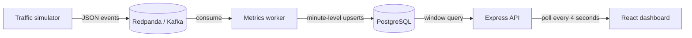

# StreamSense

StreamSense is a runnable, end-to-end streaming analytics product for monitoring
service traffic, latency, and failures in near real time.

It ships with a realistic event simulator, a Kafka-compatible Redpanda broker,
a Node.js aggregation worker, PostgreSQL storage, an Express metrics API, and a
responsive React dashboard.

## Architecture



The worker groups events by service and UTC minute, then persists:

- request count
- error count and error rate
- average latency
- p95 latency

Rows are idempotently upserted using `(minute_bucket, service)` as the primary
key. In-memory aggregation retains two hours of active windows.

## Quickstart

### Requirements

- Docker Desktop or another Docker installation with Compose

### Start the product

```bash
docker compose up --build
```

Open:

- Dashboard: [http://localhost:3001](http://localhost:3001)
- Backend health: [http://localhost:8001/health](http://localhost:8001/health)
- Metrics API: [http://localhost:8001/kpis?minutes=15](http://localhost:8001/kpis?minutes=15)

The simulator publishes traffic automatically. Within a few seconds, the
dashboard will show live telemetry for checkout, catalog, payments, identity,
and notifications services.

### Stop or reset

Stop services while preserving PostgreSQL data:

```bash
docker compose down
```

Reset the database and start from an empty state:

```bash
docker compose down -v
```

## Dashboard

The dashboard provides:

- 15, 30, and 60-minute windows
- total traffic and requests per minute
- average and p95 latency
- aggregate error rate
- per-service health and performance
- minute-level throughput and error visualization
- automatic refresh and connection recovery
- responsive layouts and reduced-motion accessibility

A service is marked:

- `healthy` when it is active and below the alert thresholds
- `degraded` at 5% error rate or 800 ms average latency
- `offline` when no updated metric has arrived for two minutes

## Event contract

Kafka topic: `events`

```json
{
  "id": "bfe678aa-4d13-488d-8738-a8df6fdf82d4",
  "service": "checkout",
  "type": "request.completed",
  "status": "ok",
  "status_code": 200,
  "latency_ms": 184,
  "ts": "2026-01-20T12:00:32.000Z"
}
```

Required fields:

- `service`: normalized to a lowercase service identifier
- `latency_ms`: finite number between 0 and 120,000

An event is counted as an error when `status` is `error`/`failed` or
`status_code` is 400 or greater.

## API contract

`GET /kpis?minutes=15`

The `minutes` parameter is clamped between 5 and 120. The response contains:

```json
{
  "generated_at": "2026-01-20T12:03:10.000Z",
  "window_minutes": 15,
  "summary": {
    "total_events": 2450,
    "events_per_minute": 163.3,
    "error_rate": 2.24,
    "avg_latency_ms": 178.4,
    "p95_latency_ms": 694,
    "active_services": 5
  },
  "timeline": [],
  "services": []
}
```

`GET /health` verifies both the API and its database connection.

## Local development

Node.js 22 or later is required.

Install all JavaScript dependencies:

```bash
npm run install:all
```

Start infrastructure:

```bash
docker compose up db kafka
```

Then run each application in its own terminal:

```bash
npm --prefix backend run dev
npm --prefix worker start
npm --prefix simulator start
npm --prefix frontend run dev
```

The development dashboard runs at
[http://localhost:3000](http://localhost:3000) and proxies API calls to the
backend at port `8001`.

## Verification

Run backend and aggregation unit tests, frontend linting, and a production
frontend build:

```bash
npm run verify
```

Continuous integration runs the same checks for pushes and pull requests.

## Repository layout

```text
.
├── backend/        # Express API and PostgreSQL schema
├── frontend/       # React dashboard and Nginx configuration
├── simulator/      # Kafka event generator
├── worker/         # Kafka consumer and minute-window aggregation
├── docker-compose.yml
└── package.json    # repository-level development commands
```

## Configuration

Docker Compose provides working development defaults. The main environment
variables are:

- `DATABASE_URL`
- `KAFKA_BROKERS`
- `KAFKA_TOPIC`
- `KAFKA_GROUP_ID`
- `KAFKA_PARTITIONS`
- `FLUSH_INTERVAL_MS`
- `EVENT_INTERVAL_MS`

These defaults are intended for local development, not production credentials.

## License

MIT. See [LICENSE](LICENSE).
