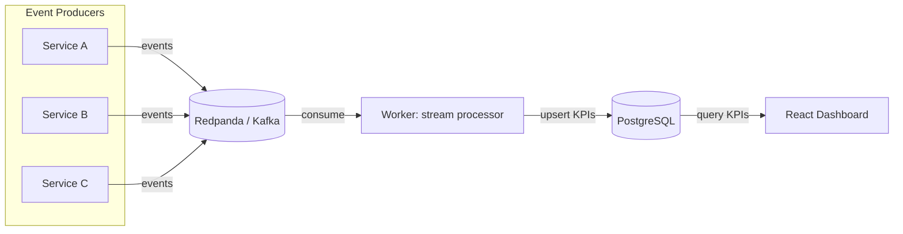
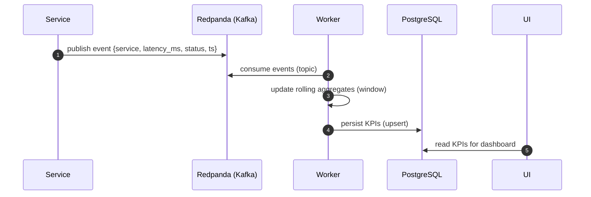

# StreamSense Reactor

**StreamSense Reactor** is a real-time streaming analytics platform that ingests high-volume service events, computes rolling KPIs, and visualizes live operational health through a web dashboard.

It’s a small, production-style **event-driven architecture**: **Kafka (Redpanda)** for transport, a **streaming worker** for aggregation, **PostgreSQL** for durable storage, and a **React** frontend for near real-time visibility.

---

## What it does

- **Ingests events** (e.g., latency, status, service name, timestamps)
- **Streams** them through Kafka (Redpanda)
- **Aggregates** rolling metrics (e.g., last N minutes)
- **Persists** KPIs to PostgreSQL
- **Visualizes** the results in a React dashboard

Use this repo as a reference for:
- event-driven system design
- stream processing fundamentals
- containerized local infrastructure
- clean repo organization for multi-service apps

---

## Architecture

### High-level system



### Event + KPI flow



---

## Tech stack

- **Streaming:** Redpanda (Kafka-compatible)
- **Storage:** PostgreSQL
- **Worker:** Node.js (stream consumer + rolling aggregation)
- **Frontend:** React + Vite
- **Infra:** Docker Compose

---

## Repository layout

```text
StreamSense-Reactor/
├── infra/
│   ├── docker-compose.yml        # local stack (redpanda + postgres + services)
│   ├── redpanda/                 # redpanda config / volumes
│   └── postgres/                 # postgres init / volumes
├── worker/
│   ├── Dockerfile
│   ├── package.json
│   └── src/
│       ├── index.js              # worker entrypoint
│       ├── kafka.js              # kafka client + consumer wiring
│       └── db.js                 # postgres connection + KPI writes
├── frontend/
│   ├── package.json
│   ├── vite.config.js
│   ├── public/
│   └── src/
│       ├── main.jsx
│       └── App.jsx               # dashboard UI
└── README.md
```

---

## Quickstart (Docker)

### Prerequisites

- Docker + Docker Compose

### Run the full stack

From the repo root:

```bash
docker compose -f infra/docker-compose.yml up --build
```

What you should expect:
- Redpanda and PostgreSQL start
- The worker connects to Kafka and begins processing
- The frontend becomes available (port depends on your compose file)

To stop:

```bash
docker compose -f infra/docker-compose.yml down
```

To reset everything (including volumes):

```bash
docker compose -f infra/docker-compose.yml down -v
```

---

## Local development (without Docker)

> Docker is recommended for a consistent setup. Use local runs for faster iteration.

### 1) Start infra only

Start Redpanda + Postgres via Docker:

```bash
docker compose -f infra/docker-compose.yml up redpanda postgres
```

### 2) Run the worker

```bash
cd worker
npm install
npm run dev   # or: npm start (depending on package.json)
```

### 3) Run the frontend

```bash
cd frontend
npm install
npm run dev
```

---

## Configuration

Configuration is typically provided via environment variables (especially when using Docker Compose). Common values you’ll see:

- `KAFKA_BROKERS` (e.g., `redpanda:9092`)
- `KAFKA_TOPIC` (events topic name)
- `PGHOST`, `PGPORT`, `PGDATABASE`, `PGUSER`, `PGPASSWORD`

If your Compose file defines different names, follow the values in `infra/docker-compose.yml`.

---

## KPIs computed

This project is designed to support rolling-window operational metrics, such as:

- request **throughput** (events/sec)
- **p50/p95 latency** (or rolling average)
- **error rate** (non-2xx / failures)
- **service health** by last-seen timestamp

Exact definitions depend on the worker implementation in `worker/src/`.

---

## Troubleshooting

- **Worker can’t connect to Kafka:** verify broker address (container vs localhost) and topic name.
- **DB connection errors:** confirm Postgres credentials + that the container is healthy.
- **No data in UI:** ensure producers are emitting events and the worker is consuming/committing.

---

## License

MIT.
