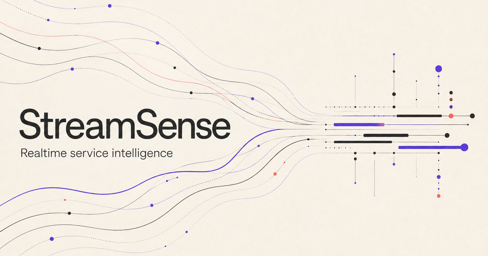
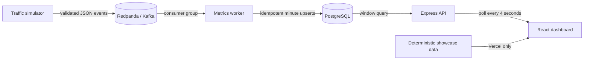

# StreamSense

StreamSense is a recruiter-ready streaming analytics product for understanding
service traffic, latency, and failures in near real time.

- **Live product showcase:** [streamsense-web.vercel.app](https://streamsense-web.vercel.app)
- **Repository:** [github.com/aaryabookseller16/Stream-Sense](https://github.com/aaryabookseller16/Stream-Sense)



The hosted experience uses deterministic sample telemetry so every visitor can
evaluate the complete interface without credentials or a long-running broker.
The repository also includes the full live pipeline: a traffic simulator,
Kafka-compatible Redpanda broker, Node.js aggregation worker, PostgreSQL,
Express API, and React dashboard.

## Why it exists

Raw logs make it difficult to understand how a distributed system is behaving.
StreamSense turns request events into a focused operational view of throughput,
error rates, latency, and service health. It is designed to demonstrate both
stream-processing architecture and product judgment—not to replace a production
observability platform.

## Architecture



The worker groups events by service and UTC minute and persists request count,
error count, average latency, and p95 latency. `(minute_bucket, service)` is the
database primary key, so repeated flushes update a stable window instead of
creating duplicates. In-memory aggregation retains two hours of active windows.

## Try the complete live pipeline

Requirements: Docker Desktop (or Docker Engine with Compose).

```bash
docker compose up --build
```

Then open:

- Product overview: [http://localhost:3001](http://localhost:3001)
- Live dashboard: [http://localhost:3001/dashboard](http://localhost:3001/dashboard)
- Backend health: [http://localhost:8001/health](http://localhost:8001/health)
- Metrics API: [http://localhost:8001/kpis?minutes=15](http://localhost:8001/kpis?minutes=15)

The simulator begins publishing traffic automatically. Within a few seconds,
the dashboard shows telemetry for checkout, catalog, payments, identity, and
notifications.

```bash
# Stop while preserving PostgreSQL data
docker compose down

# Reset all local data
docker compose down -v
```

## Product experience

The interface includes:

- A clear product story and visual explanation of the event path.
- Separate 15, 30, and 60-minute windows.
- Total traffic, requests per minute, average/p95 latency, and error rate.
- Per-service health and performance states.
- Minute-level throughput and error visualization plus an accessible data table.
- Loading, empty, disconnected, and recovery states.
- Keyboard focus, reduced-motion support, responsive layouts, and semantic HTML.
- An explicit data-provenance banner distinguishing Vercel showcase data from
  the live Docker pipeline.

A service is `healthy` while active and below its alert thresholds, `degraded`
at a 5% error rate or 800 ms average latency, and `offline` if it has not
reported for two minutes.

## Event contract

Kafka topic: `events`

```json
{
  "id": "bfe678aa-4d13-488d-8738-a8df6fdf82d4",
  "service": "checkout",
  "type": "request.completed",
  "status": "ok",
  "status_code": 200,
  "latency_ms": 184,
  "ts": "2026-01-20T12:00:32.000Z"
}
```

`service` is normalized to a lowercase identifier. `latency_ms` must be finite
and between 0 and 120,000. An event is an error when `status` is `error` or
`failed`, or when `status_code` is 400 or greater. Invalid events are rejected
without stopping the consumer.

## API contract

`GET /kpis?minutes=15` clamps `minutes` between 5 and 120 and returns:

```json
{
  "generated_at": "2026-01-20T12:03:10.000Z",
  "window_minutes": 15,
  "summary": {
    "total_events": 2450,
    "events_per_minute": 163.3,
    "error_rate": 2.24,
    "avg_latency_ms": 178.4,
    "p95_latency_ms": 694,
    "active_services": 5
  },
  "timeline": [],
  "services": []
}
```

`GET /health` checks both the API process and its database connection. API
responses disable caching, use security headers, enforce a small JSON body
limit, rate-limit requests, and deny cross-origin browser access unless allowed
origins are configured.

## Development and verification

Node.js 22 or later is required.

```bash
npm run install:all   # locked installs for all four applications
npm run verify        # 18 unit/component tests, lint, production build
npm run smoke:compose # clean end-to-end pipeline smoke test (requires Docker)
```

For split-process development:

```bash
docker compose up db kafka
npm --prefix backend run dev
npm --prefix worker start
npm --prefix simulator start
npm --prefix frontend run dev
```

Set `VITE_DATA_MODE=live` when the development frontend should call the API.
Without it, the Vite development server intentionally runs the deterministic
showcase. The production Docker image sets live mode automatically.

GitHub Actions runs locked installs, the complete verification suite, Compose
configuration validation, and a clean Docker smoke test that waits until the
simulator's events are queryable through the API.

## Deployment

The public website is a static Vite build deployed on Vercel. It has no secrets,
database connection, or hidden service dependency. Direct navigation to
`/dashboard` is handled by the committed Vercel rewrite.

```bash
cd frontend
npm ci
npm run build
vercel --prod
```

The full streaming runtime is intentionally documented as a Docker deployment,
not represented as a hosted Railway/Upstash environment. Hosting the broker,
worker, database, and API would require long-running managed services and is a
separate production-infrastructure decision.

## Configuration

Docker Compose contains safe local defaults. Runtime configuration includes:

- `DATABASE_URL` — backend and worker PostgreSQL connection.
- `KAFKA_BROKERS`, `KAFKA_TOPIC`, `KAFKA_GROUP_ID`, `KAFKA_PARTITIONS` — stream services.
- `KAFKA_SSL`, `KAFKA_SASL_MECHANISM`, `KAFKA_SASL_USERNAME`,
  `KAFKA_SASL_PASSWORD` — optional managed-broker security.
- `FLUSH_INTERVAL_MS` and `EVENT_INTERVAL_MS` — pipeline cadence.
- `CORS_ALLOWED_ORIGINS` — comma-separated browser origins; empty fails closed.
- `VITE_API_URL` — optional cross-origin API base URL.
- `VITE_DATA_MODE` — `demo` for the static showcase or `live` for API-backed data.

Never commit production credentials. `.env.example` documents local values and
all other `.env` files are ignored.

## Repository map

```text
.
├── backend/        # Express API, PostgreSQL schema, and API tests
├── frontend/       # React interface, deterministic showcase, and UI tests
├── simulator/      # Kafka event generator
├── worker/         # Kafka consumer, aggregation, and worker tests
├── scripts/        # End-to-end Compose smoke test
├── docs/           # Recruiter-facing release scorecard
├── docker-compose.yml
└── package.json    # Repository-level commands
```

## Engineering limits

- The public site is a reproducible product showcase, not live production telemetry.
- Aggregation is designed for a portfolio-scale demo; a high-volume deployment
  would move percentile calculation to a bounded histogram or streaming sketch.
- Authentication, alert delivery, and multi-tenant isolation are future product work.
- The summary p95 is the highest service p95, a deliberate worst-service signal,
  rather than a mathematically merged percentile across services.

## License

MIT. See [LICENSE](LICENSE).
